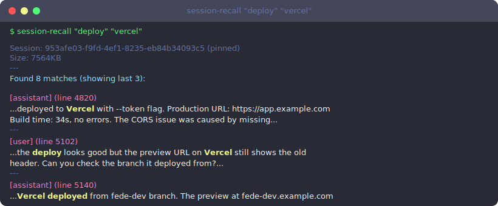
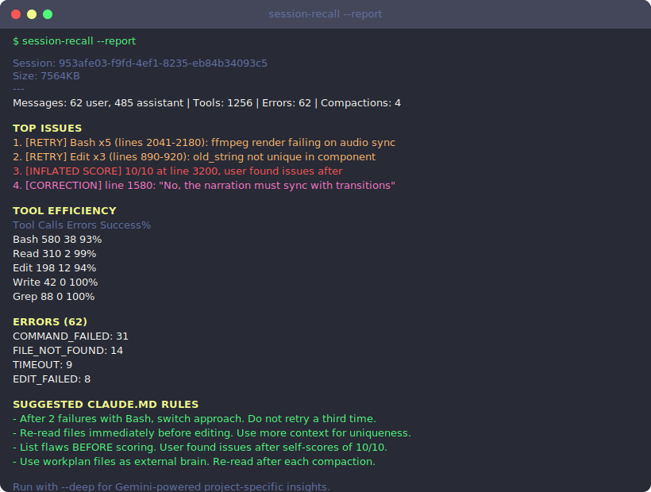

# session-recall

Claude Code forgets everything after context compaction. This gets it back.

```bash
npx session-recall "the thing you lost"
```

## The problem

When Claude Code compacts context, you get a vague summary. Details vanish: decisions, error solutions, specific commands that worked, corrections you gave. You're left grepping through JSON soup in `~/.claude/projects/`.

session-recall parses those JSONL transcripts properly. It extracts human-readable messages, tool calls, errors, and patterns, so you find what you need in seconds.

## Search any past session

Find exactly what was lost after compaction:

<p align="center">
  
</p>

## Analyze your sessions

`--report` finds retry loops, errors, user corrections, inflated self-scores, and generates CLAUDE.md rules to prevent the same mistakes:

<p align="center">
  
</p>

## Cross-session patterns

`--all` analyzes your last N sessions to find recurring problems:

```
$ session-recall --all 10

CROSS-SESSION SUMMARY (10 sessions)
  Total tool calls: 4351 | Total errors: 165

RECURRING RETRY PATTERNS
  Bash: retried in 7/10 sessions (avg 4.2x when it happens)

SELF-SCORING ACCURACY
  185 scores across 10 sessions (avg 7.7/10)
  20/185 (11%) had user issues after

RECURRING ERROR TYPES
  COMMAND_FAILED: in 8/10 sessions
  FILE_NOT_FOUND: in 6/10 sessions
```

## Deep analysis via Gemini

`--deep` sends structured session data to Gemini for project-specific insights instead of generic advice:

```
$ session-recall --report --deep

DEEP ANALYSIS (via Gemini)

1. PROJECT CONTEXT: Building a video generation pipeline with Remotion.

2. CLAUDE.MD RULES:
   - When ElevenLabs returns 429, wait 30s before retry. Agent wasted 20 calls.
   - Always check ffmpeg output file exists before proceeding to next step.
   - User wants narration synced with visual transitions, not just content.

3. BIGGEST TIME WASTER: 47 minutes retrying a Bash command blocked by a
   pre-commit hook. Switch approach after first hook rejection.
```

## All commands

```bash
# Search
session-recall "keyword"              # Find keyword in current session
session-recall "error" "deploy"       # AND search (both must match)
session-recall --recent 10            # Last 10 messages (no tool noise)
session-recall --decisions            # Find decision points
session-recall --tools "Edit"         # Search tool calls only
session-recall --list                 # List all sessions

# Pin a session (auto-namespaced per Claude process)
session-recall --pin-by "project-x"   # Pin session containing keyword
session-recall --unpin                # Remove pin

# Analyze
session-recall --report               # Errors, retries, corrections, rules
session-recall --report --deep        # + Gemini project-specific insights
session-recall --all                  # Cross-session patterns (last 10)
session-recall --all 20 --deep        # Cross-session + Gemini

# Apply rules (interactive review, then append to CLAUDE.md / MEMORY.md)
session-recall --apply                # Template-based rules
session-recall --apply --deep         # + Gemini project-specific rules
```

## Apply rules to CLAUDE.md

`--apply` generates rules, shows each one for review, and appends approved rules to your project's CLAUDE.md:

```
$ session-recall --apply --deep

Running Gemini deep analysis...
Project: Building session-recall CLI tool for Claude Code transcript recovery.

==================================================
REVIEW CLAUDE.MD RULES (5 items)
==================================================
  [y] approve  [n] skip  [e] edit  [a] approve all  [q] quit

  (1/5) After 2 failures with Bash, switch approach. Do not retry a third time.
  > y

  (2/5) When Gemini returns malformed JSON, strip markdown fences before parsing.
  > e
  new text> Strip ```json fences from Gemini responses before JSON.parse().
  ...

Appended 4 rules to /root/my-project/CLAUDE.md
Appended 2 entries to ~/.claude/projects/-root-my-project/memory/MEMORY.md
```

## MCP server

Give Claude Code direct access to past session context. Add to `~/.claude/settings.json`:

```json
{
  "mcpServers": {
    "session-recall": {
      "command": "npx",
      "args": ["-y", "session-recall", "--mcp"]
    }
  }
}
```

Claude Code gets 6 tools:

| Tool | What it does |
|------|-------------|
| `recall_search` | Search past sessions by keyword |
| `recall_recent` | Get last N messages (no tool noise) |
| `recall_report` | Analyze session patterns and suggest rules |
| `recall_apply` | Append approved rule to CLAUDE.md or MEMORY.md |
| `recall_decisions` | Find decision points |
| `recall_list` | List available sessions |

After compaction, Claude can call `recall_search` to recover lost context, then `recall_report` to suggest rules, and `recall_apply` (with your approval) to persist the lessons.

## Setup

```bash
npx session-recall --help
```

For deep analysis and MCP `--deep` mode, add a Gemini key:

```bash
mkdir -p ~/.config/session-recall
echo "your-gemini-key" > ~/.config/session-recall/gemini-key
chmod 600 ~/.config/session-recall/gemini-key
```

Or set `GEMINI_API_KEY` as an env var.

## Part of Building Open

Open-source tools for Claude Code power users:

- [**session-recall**](https://github.com/buildingopen/session-recall) - Recover context after compaction
- [**claude-wrapped**](https://github.com/buildingopen/claude-wrapped) - Your Claude Code year in review
- [**bouncer**](https://github.com/buildingopen/bouncer) - AI quality audit for any work
- [**blast-radius**](https://github.com/buildingopen/blast-radius) - Impact analysis before code changes

## License

MIT
